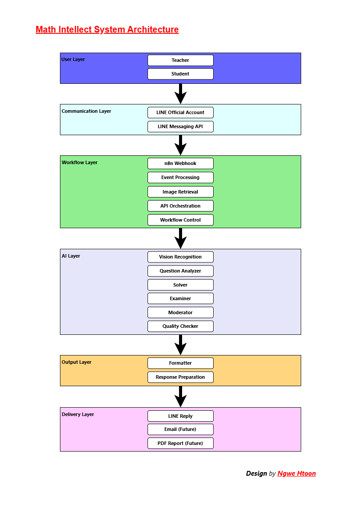
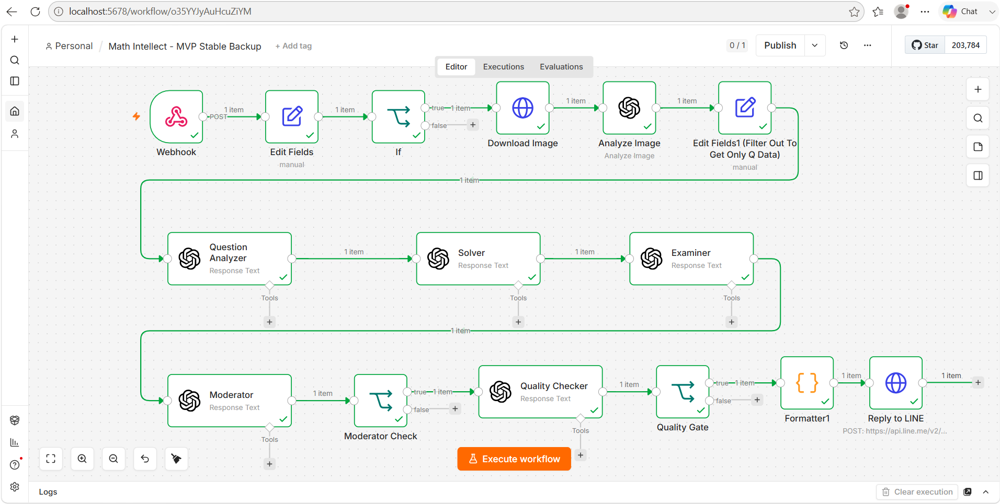
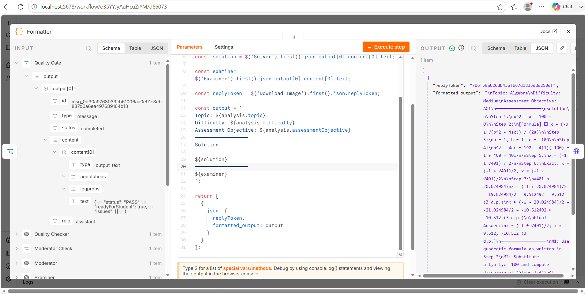
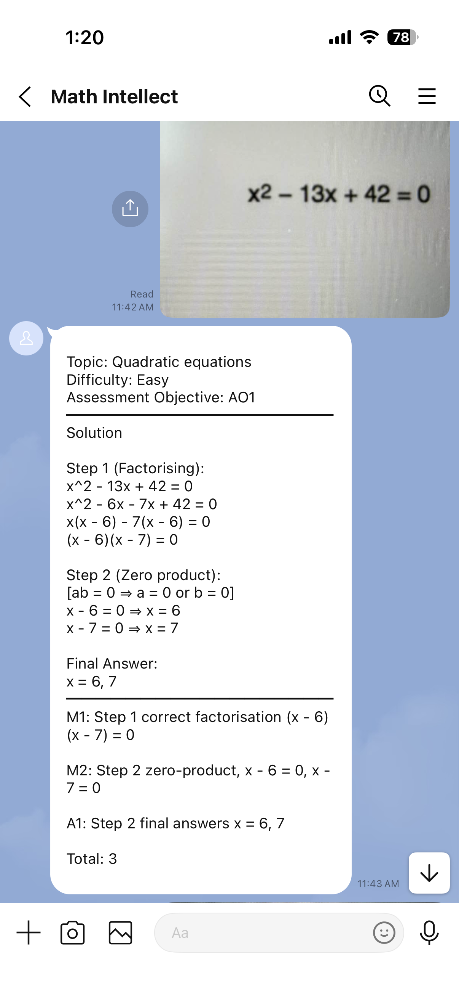
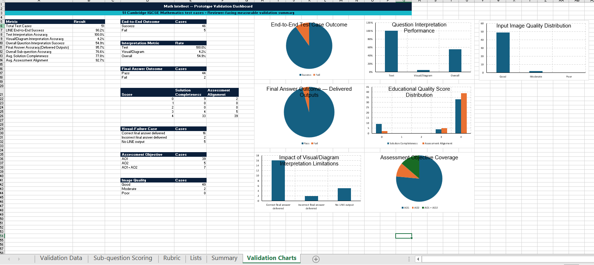

  

# Math Intellect
## AI-Assisted Mathematics Learning Platform

**Project Lead:** Ngwe Htoon (Howard)
**Role:** AI EdTech Product Developer | Mathematics Educator | Software R&D Professional

Math Intellect is a functional MVP that combines AI-assisted image interpretation, mathematical reasoning, curriculum-aware processing, quality assurance, workflow automation, and LINE-based delivery to provide structured mathematics learning support beyond classroom hours.

## Project Overview
Math Intellect is an AI-assisted learning platform designed to support mathematics education in international schools. The project combines mathematics pedagogy, workflow automation, and large language models (LLMs) to transform handwritten examination questions into structured, examination-oriented solutions.

Built on n8n, the LINE Messaging API, and the OpenAI API, the platform allows students and teachers to submit mathematics problems through a familiar messaging interface and receive step-by-step solutions, assessment insights, and assessment-oriented guidance in real time.

The current prototype focuses on Cambridge IGCSE Mathematics and is informed by classroom teaching practice, curriculum requirements, and examination-oriented assessment principles.

Math Intellect is a self-initiated EdTech project developed from the intersection of embedded-software engineering experience, international mathematics education, and AI-enabled workflow development.

## The Problem	
Students often encounter difficult mathematics questions outside scheduled lesson hours, when immediate teacher support is unavailable. Teachers also face significant workloads in assessment preparation, feedback, and individual learner support.

General-purpose AI tools can generate mathematical responses quickly, but their outputs may vary in structure, completeness, image interpretation, curriculum alignment, and assessment relevance.

Math Intellect was created to:
	
	- provide structured, step-by-step mathematical reasoning
	- provide assessment-oriented guidance informed by curriculum and marking principles
	- bridge the gap between general AI responses and classroom practice
	- extend mathematics learning support beyond scheduled lesson hours

## Core Features
AI-Powered Question Recognition

	- Receives handwritten or printed mathematics questions through LINE
	- Extracts mathematical content directly from uploaded images
	- Supports examination-style question formats

Multi-Layer Reasoning Engine (AI processing workflow)

The platform does not rely on a single AI response. Instead, it employs a structured verification pipeline and each layer performs an independent role to improve consistency, explainability, and output quality.

1. **Question Analyzer**
	
	Interprets the submitted image, reconstructs the question, identifies the topic and extracts relevant information.

2. **Solver**
	
	Generates a complete step-by-step mathematical solution.

3. **Examiner**
	
	Reviews the solution from an assessment perspective and produces examiner-inspired guidance.

4. **Moderator**
	
	Checks consistency among question interpretation, solution and assessment output.

5. **Quality Checker**
	
	Performs an additional review of correctness, completeness, clarity and structure.

6. **Formatter**
	
	Converts verified information into a concise student-facing response for LINE.

### Examination-Oriented Output

	- Step-by-step mathematical solutions
	- Examiner-inspired assessment guidance
	- Assessment-objective classification
	- Structured feedback for students and teachers

## System Architecture

The current MVP runs as a locally hosted development prototype using n8n. ngrok is used to expose the local webhook during development. Cloud deployment and persistent infrastructure are planned for later deployment.

## Technology Stack

| Layer | Technology | Role |
|---|---|---|
| Workflow Automation | n8n | End-to-end workflow orchestration |
| AI Processing | OpenAI API | Vision and language processing |
| Communication | LINE Official Account / Messaging API | Student input and response delivery |
| Processing Logic | JavaScript | Structured data handling and response formatting |
| Development Access | ngrok | Local webhook exposure during prototype development |
| Planned Infrastructure | Docker / PostgreSQL | Future deployment and persistent data services |

## Educational Perspective
Math Intellect is shaped not only by software engineering, but also by years of experience in international mathematics education.

The system architecture reflects a classroom workflow:

	Understanding the question.
	Solving the problem.
	Evaluating the reasoning.
	Reviewing accuracy.
	Presenting clear feedback.

This educational approach distinguishes the project from conventional chatbot-based solutions.

## Current MVP Status
### Implemented

	- LINE image submission
	- Webhook and image retrieval
	- Vision-based question analysis
	- Multi-stage mathematical reasoning
	- Examiner / Moderator / Quality Checker stages
	- Structured LINE response
	- JavaScript-based structured response formatting

### Planned

	- PDF report delivery
	- Persistent learner records
	- Teacher dashboard
	- Question and worksheet generation
	- Performance analytics
	- Expanded syllabus support
	- Multilingual support
	- Cloud deployment

## MVP Evidence

The current MVP has been implemented and tested through the complete workflow from LINE-based question submission to AI-assisted processing, quality review, formatting, and final response delivery.

### n8n Workflow
The functional n8n workflow demonstrates the implemented multi-stage AI processing pipeline, including Question Analyzer, Solver, Examiner, Moderator, Quality Checker, and Formatter stages.

### Structured Output Formatter
The Formatter stage converts verified workflow outputs into a structured, student-facing mathematics response for delivery through LINE.

### LINE User Interaction
End-to-end testing confirms that mathematics questions can be submitted through LINE and processed through the implemented workflow to produce structured student-facing responses.

### Prototype Validation
The current prototype was evaluated using 51 Cambridge IGCSE Mathematics test cases covering text-based questions and questions containing visual or diagram information. The validation framework evaluates question interpretation, mathematical accuracy, solution completeness, assessment alignment, and end-to-end LINE delivery.

| Validation Metric | Result |
|---|---:|
| Total Test Cases | 51 |
| Text Interpretation Accuracy | 100.00% |
| Visual/Diagram Interpretation Accuracy | 4.17% |
| Overall Question Interpretation Success | 54.90% |
| Final Mathematical-Answer Accuracy | 95.65% |
| Overall Sub-question Accuracy | 76.62% |
| Average Solution Completeness | 77.78% |
| Average Assessment Alignment | 92.66% |
| Successful End-to-End LINE Response Rate | 90.20% |

### Validation Dashboard

The validation results demonstrate strong performance in text interpretation, final mathematical-answer accuracy, assessment alignment, and end-to-end LINE delivery. They also identify visual and diagram interpretation as a significant current limitation of the prototype and therefore a priority for future technical improvement.

Detailed test-case records, scoring criteria, failure-stage analysis and supporting evidence are maintained in the project validation record.

### Detailed Validation Evidence

[View the Prototype Validation Evidence Report (PDF)](validation/Math_Intellect_Prototype_Validation_Evidence_Record.pdf)

[Download the Prototype Validation Record (XLSX)](validation/Math_Intellect_Prototype_Validation_Record.xlsx)

[Download the Prototype Validation Evidence Slides (PPTX)](validation/Math_Intellect_Prototype_Validation_Evidence_Record.pptx)

## Implementation Notes

- The workflow is orchestrated sequentially through n8n
- Each processing stage receives structured information from the previous stage
- Processing responsibilities are separated rather than assigned to one prompt
- JavaScript is used to control structured data transformation and final formatting
- LINE currently serves as the prototype user interface
- ngrok is used only for development webhook access and is not treated as production hosting

## Curriculum Alignment and Quality Assurance
The current Math Intellect MVP is developed with reference to Cambridge IGCSE Mathematics 0580 and Cambridge IGCSE Additional Mathematics 0606.

The workflow considers curriculum topic, expected solution depth, relevant assessment objectives, and calculator/non-calculator context when processing mathematics questions.

The quality-assurance framework evaluates five dimensions:

	- **Input Integrity** - whether the submitted question is readable and correctly interpreted
	- **Curriculum Fit** – whether terminology, method and learning objective are appropriate
	- **Mathematical Validity** – whether calculations, reasoning and final answers are correct
	- **Assessment Consistency** – whether assessment guidance is broadly consistent with relevant assessment objectives and marking principles
	- **Output Quality** – whether the final response is clear, complete and student-friendly

## Current Limitations
The current version is an MVP and has several known limitations:

- Image interpretation quality depends on the clarity of the submitted image
- AI-generated mathematical responses require continued validation across a broader range of question types and visual formats
- The current system does not yet include persistent learner records
- Cloud deployment is not yet implemented
- Teacher dashboards and institutional administration tools are planned
- Broader curriculum coverage and assessment behaviour require further controlled validation

## Future Roadmap
### 2026 - Functional MVP
**Phase 1: Intelligent Mathematics Assistant**
	
	- Image-based mathematics solving and automated feedback
	- Functional MVP
	- Structured technical validation
	- GitHub technical documentation

### 2027 - Teacher Dashboard & Cloud SaaS Platform
**Phase 2: Teacher Productivity Platform**
	
	- Worksheet generation and assessment-support tools
	- Teacher dashboard
	- Cloud deployment
	- SaaS architecture

### 2028 - School Partnerships & Institutional Licensing
**Phase 3: School-Level Deployment**
	
	- Learning analytics and institutional tools
	- School and learning-centre pilots
	- Institutional licensing model

### 2029+ - Regional Expansion & AI Learning Analysis
**Phase 4: Regional Expansion**
	
	- Expanded international-curriculum support
	- Regional expansion
	- AI-assisted learning analytics

## Long-Term Vision
Math Intellect aims to evolve into an AI-assisted STEM learning platform that extends access to structured mathematics support while preserving the central role of teachers.

The long-term objective is to support more adaptive and accessible learning through familiar digital devices, while using intelligent automation, explainable reasoning, and scalable education technology to complement teaching practice.

## Future Product and Commercial Potential
The platform combines expertise from three domains:

	- Mathematics education
	- Artificial intelligence
	- Workflow automation

Its architecture is designed to support future applications in:

	- International schools
	- Private learning centres
	- Teacher productivity tools
	- AI-assisted assessment systems

Math Intellect represents an early-stage EdTech initiative with the potential to scale into a broader educational ecosystem serving students and educators across Asia.

## Project Report

The project report provides a consolidated overview of Math Intellect, including its educational objectives, system architecture, AI workflow, curriculum alignment, MVP implementation, validation, and future development.

[View the Math Intellect Project Report (PDF)](reports/Math_Intellect_Project_Report_Public.pdf)