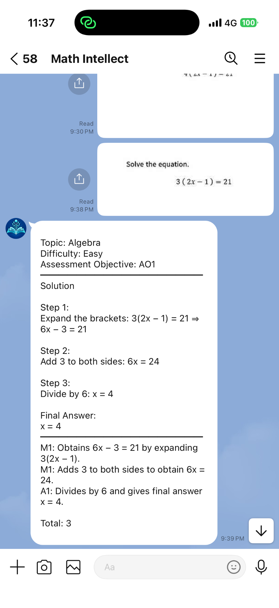

# Sample Output 01 — Linear Equation

## Math Intellect — AI-Assisted Mathematics Learning Platform

**Sample ID:** SAMPLE-01  
**Document status:** Recorded response from one LINE-based MVP demonstration, with a separate mathematical review; not a general reliability or official-marking claim.  
**Related input:** [Sample Question 01](sample-question-01.md)  
**Output channel:** Math Intellect LINE Official Account  
**Processing context:** n8n and OpenAI API workflow, as documented in the project  
**Recorded test date:** 2026-09-16 (as supplied in the sample record)

## Test and Evidence Summary

| Item | Recorded observation |
|---|---|
| Submitted question | $3(2x-1)=21$ |
| Input format | Image containing a text-based algebra question |
| LINE reply | Delivered; visible in the supplied screenshot |
| n8n execution status | Not independently established by the LINE screenshot alone; no execution log included in this sample |
| Mathematical review | Question and solution agree with the supplied image and independent calculation |
| Assessment guidance review | Indicative M1/M1/A1 guidance reviewed for internal coherence only; **not** checked against an official mark scheme |

## Actual LINE Response — Transcription

The following transcribes the displayed response for **this question** from the supplied LINE screenshot. Markdown line wrapping may differ from the phone display; the mathematical content and assessment annotations have not been corrected or rewritten.

### Header — Question Analysis and Assessment Context

```text
Topic: Algebra
Difficulty: Easy
Assessment Objective: AO1
```

### Body — Step-by-Step Solution

```text
Solution

Step 1:
Expand the brackets: 3(2x − 1) = 21 ⇒ 6x − 3 = 21

Step 2:
Add 3 to both sides: 6x = 24

Step 3:
Divide by 6: x = 4

Final Answer:
x = 4
```

### Tail — Examiner-Inspired Assessment Guidance

```text
M1: Obtains 6x − 3 = 21 by expanding 3(2x − 1).
M1: Adds 3 to both sides to obtain 6x = 24.
A1: Divides by 6 and gives final answer x = 4.

Total: 3
```

**Assessment boundary:** The AO1 label and M1/M1/A1 allocation are AI-generated, examination-oriented annotations for this self-authored question. The mathematical steps are correct, but no official Cambridge assessment-objective classification or mark allocation has been independently established for this sample.

## LINE Output Screenshot



The relevant interaction is the question image marked **9:38 PM** and the corresponding Math Intellect reply marked **9:39 PM**. The latest screenshot displays the complete question and reply without an unrelated earlier answer. A cropped fragment of a previous **question image** remains visible above the 9:38 PM submission; it is unrelated to SAMPLE-01 and does not affect interpretation of the demonstrated exchange.

## Independent Mathematical Review

| Criterion | Finding | Basis |
|---|---|---|
| Question interpretation | Pass for this example | The response solves the equation visible in the submitted image. |
| Algebraic reasoning | Pass for this example | Expansion, addition of 3, and division by 6 are correct. |
| Final answer | Pass for this example | Substitution gives $3(2\times4-1)=21$. |
| Assessment guidance | Internally coherent; official alignment unverified | The annotations correspond to the displayed method, but no official marking reference was provided. |
| Response completeness | Pass for this example | The reply contains a header, worked solution, final answer, and guidance. |
| LINE delivery | Observed | The relevant response is visible in the screenshot. |

**Reference answer:** $x=4$.

**Reviewer note:** In this single demonstration, the equation was interpreted correctly, the worked solution is mathematically correct, and the corresponding LINE reply is visible. It does not demonstrate official marking equivalence or establish the system's accuracy for other questions, especially diagram-based inputs.

## Interpretation and Limitations

This is **one selected sample**, separate from the project's 51-case technical validation record. A successful reply is not proof that every workflow execution succeeds, that the assessment guidance matches a Cambridge mark scheme, that learners improve, or that the product is ready for unsupervised school deployment. For aggregate metrics and their applicable denominators, consult the validation record rather than extrapolating from this example.

## Related Documents

- [Sample Question 01](sample-question-01.md)
- [Project README](../README.md)
- [Validation Methodology](../docs/validation-methodology.md)
