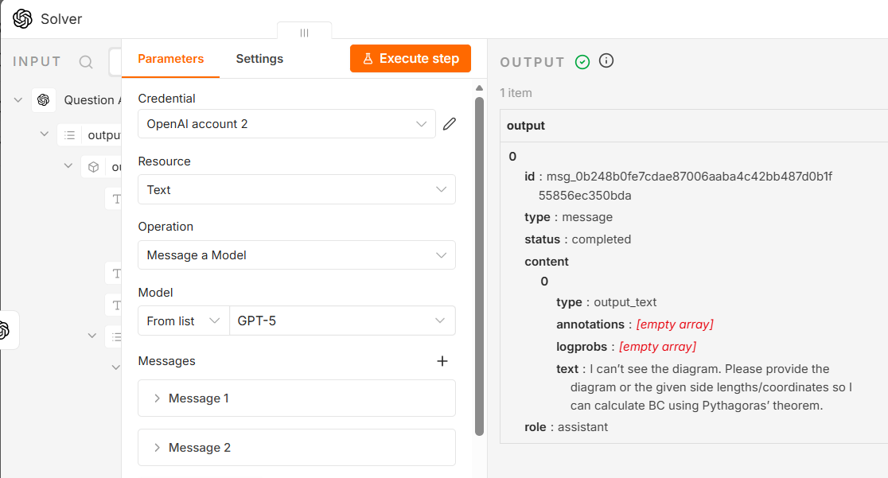
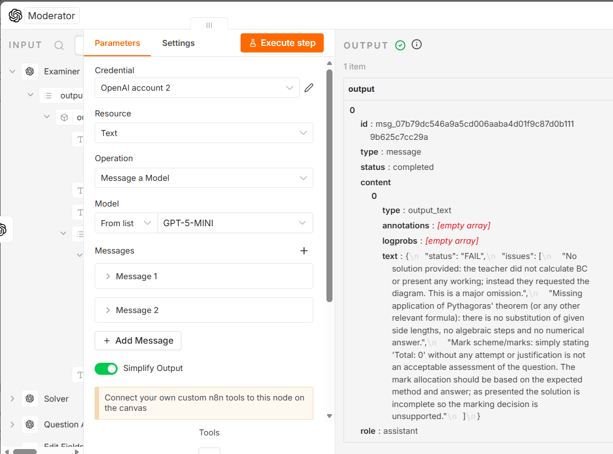
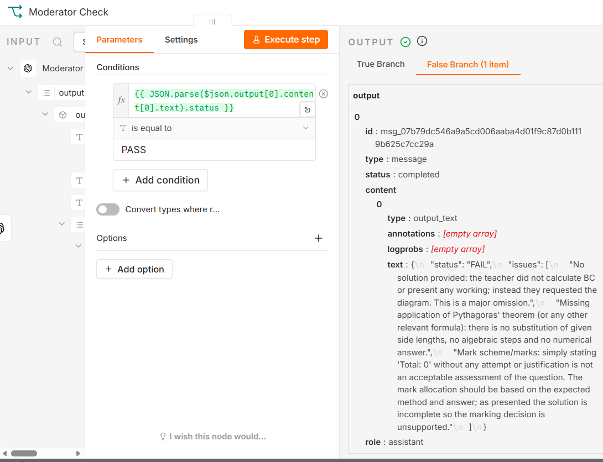

# Sample Output 02 — Diagram-Based Right-Triangle Trigonometry

## Math Intellect — AI-Assisted Mathematics Learning Platform

**Sample ID:** SAMPLE-02  
**Document status:** Recorded failure-case output from an actual MVP interaction; subject to independent review.  
**Related input:** [Sample Question 02](sample-question-02.md)  
**Output channel:** LINE Official Account  
**Processing:** n8n and OpenAI API workflow

## Test Information

| Field | Recorded information |
|---|---|
| Test question | SAMPLE-02 |
| Question type | Diagram-based right-triangle trigonometry |
| Workflow execution | Partial completion with failure path |
| LINE response delivery | Not delivered |
| Independent review | Failure evidence documented |

## Observed Failure Sequence

According to the recorded workflow review, the Analyze Image stage extracted the written instruction but did not successfully capture the mathematical information encoded in the triangle diagram.

### 1. Solver Output

The Solver did not generate a mathematical solution. Instead, it returned the following message:

> “I can’t see the diagram. Please provide the diagram or the given side lengths/coordinates so I can calculate BC using Pythagoras’ theorem.”

This indicates that the mathematical givens required for solution generation were not available to the Solver in usable form.

### 2. Moderator Output

The Moderator evaluated the incomplete solver response and returned a `FAIL` status. The recorded issues included:

- No solution provided
- Missing application of Pythagoras’ theorem or another relevant method
- No substitution of given side lengths
- No algebraic steps and no numerical answer
- Unsupported mark allocation

### 3. Moderator Check Routing

The next node, **Moderator Check**, tested whether the parsed moderation `status` was equal to `PASS`.

Because the Moderator returned `FAIL`, the condition evaluated **False** and the item was routed to the **False Branch** rather than the PASS branch.

This confirms that the normal PASS route was not followed during this execution.

## Final Outcome

No final mathematical answer was delivered through LINE during this test.

Based on the recorded evidence, the failure sequence can be summarised as follows:

1. Diagram information was not successfully extracted for downstream use.
2. The Solver therefore did not produce a mathematical solution.
3. The Moderator returned `FAIL`.
4. The Moderator Check node routed the item to the **False Branch**, preventing continuation through the normal PASS-based delivery path.

## Independent Verification

| Criterion | Review result |
|---|---|
| Question interpretation | Fail |
| Mathematical reasoning | Fail |
| Final answer generation | Fail |
| Output completeness | Fail |
| Moderator status | FAIL |
| Moderator Check routing | False Branch |
| LINE final answer delivery | Not received |

**Expected final answer (independent reference):** **BC = 20 cm**

**Reviewer notes:**

The recorded failure is consistent with a diagram-information extraction limitation. The expected answer can be obtained independently from the diagram, but the MVP did not successfully extract the necessary givens to complete the solution workflow in this test.

## Interpretation of the Sample

This document records one selected failure case from the Math Intellect functional MVP.

It is included to demonstrate a current limitation in diagram-dependent question handling. This sample should not be interpreted as evidence that all diagram-based questions fail, nor does one failure case replace the project’s broader validation record.

## Related Documents

- [Sample Question 02](sample-question-02.md)
- [Project README](../README.md)
- [Validation Methodology](../docs/validation-methodology.md)
