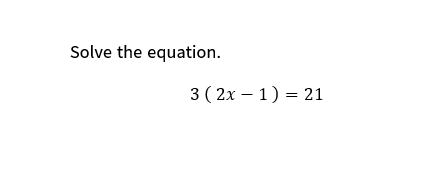

# Sample Question 01 — Linear Equation

## Math Intellect — AI-Assisted Mathematics Learning Platform

**Sample ID:** SAMPLE-01  
**Document status:** Self-authored demonstration input submitted through the functional MVP; paired with a recorded LINE response.  
**Question source:** Self-authored demonstration question (as identified in the supplied sample record)  
**Question type:** Text-based algebra, submitted as an image  
**Curriculum reference:** Cambridge IGCSE Mathematics (0580) — topic reference, not an official examination question  
**Topic:** Algebra — Linear Equations  
**Input method:** Image sent to the Math Intellect LINE Official Account  
**Related output:** [Sample Output 01](sample-output-01.md)

## Original Question

The submitted image asks:

> Solve the equation.

$$
3(2x-1)=21
$$

The image does **not** include the instruction “Show all your working”; the worked solution below is an independent reference for reviewing the response.

## Submitted Question Image

The image above is the supplied input evidence for this demonstration.

## Independent Reference Solution

$$
\begin{aligned}
3(2x-1)&=21\\
6x-3&=21\\
6x&=24\\
x&=4
\end{aligned}
$$

**Expected final answer:** $x=4$.

This is an independently prepared mathematical reference, **not** the system output or an official Cambridge mark scheme.

## Demonstration Purpose and Evidence Boundary

The sample records image submission of a text-based linear equation and provides a mathematical reference against which the actual LINE reply can be reviewed. It is a selected demonstration, not a randomly sampled test case or evidence of complete syllabus coverage. It does not replace the project's separately reported 51-case prototype validation.

## Related Documents

- [Recorded LINE output and review](sample-output-01.md)
- [Project README](../README.md)
- [Validation methodology](../docs/validation-methodology.md)
