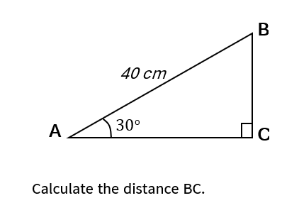

# Sample Question 02 — Diagram-Based Right-Triangle Trigonometry

## Math Intellect — AI-Assisted Mathematics Learning Platform

**Sample ID:** SAMPLE-02  
**Document status:** Original mathematics question used to document a diagram-dependent failure case in the functional MVP.  
**Question source:** Self-authored demonstration question  
**Question type:** Diagram-based right-triangle trigonometry question  
**Curriculum reference:** Cambridge IGCSE Mathematics (0580)  
**Topic:** Trigonometry — Right-Angled Triangles  
**Input method:** Image submission through LINE

## Original Question

Calculate the distance **BC**.

## Question Image

The image above is the question submitted to the Math Intellect LINE Official Account.

## Information Encoded in the Diagram

The mathematical information needed to solve the question is primarily embedded in the diagram:

- **AB = 40 cm**
- **∠BAC = 30°**
- **∠ACB = 90°**
- Required side: **BC**

Unlike Sample 01, the key givens are not fully restated in the sentence below the diagram. Successful solution therefore depends on extracting information from the diagram itself.

## Independent Reference Solution

Using the sine ratio:

$$
\sin 30^\circ = \frac{BC}{40}
$$

$$
BC = 40 \sin 30^\circ = 40 \times \frac{1}{2} = 20
$$

**Expected final answer:** **BC = 20 cm**

The reference solution is provided for independent verification. It is not presented as an AI-generated output or an official Cambridge mark scheme.

## Sample Purpose

This sample documents a diagram-dependent failure case. It is included to show a current limitation of the functional MVP when the required mathematical facts must be extracted from the diagram rather than from the surrounding text alone.

## Related Output

[View Sample Output 02](sample-output-02.md)

## Evidence Boundary

This example illustrates one selected test interaction. It does not establish accuracy across the full syllabus or replace the project’s 51-case validation record.
